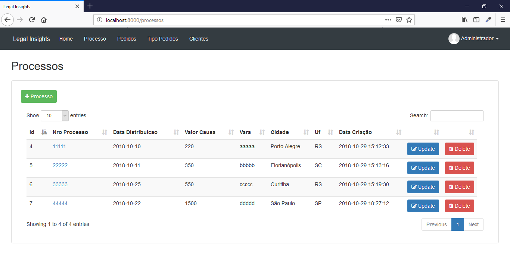
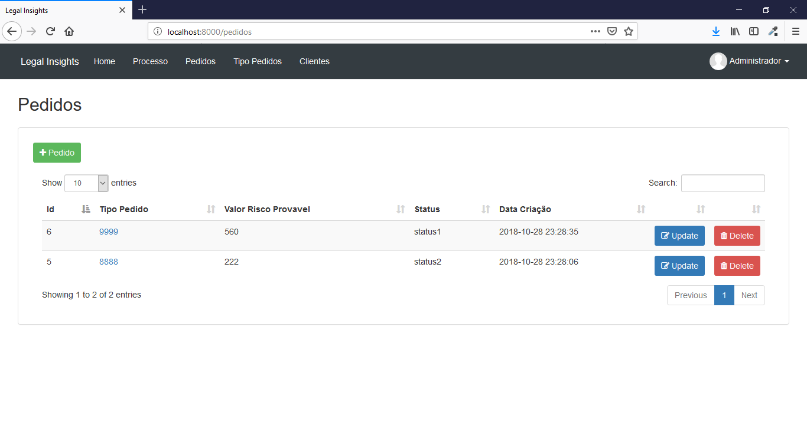
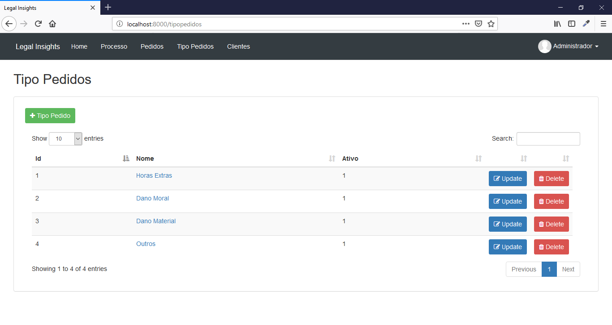
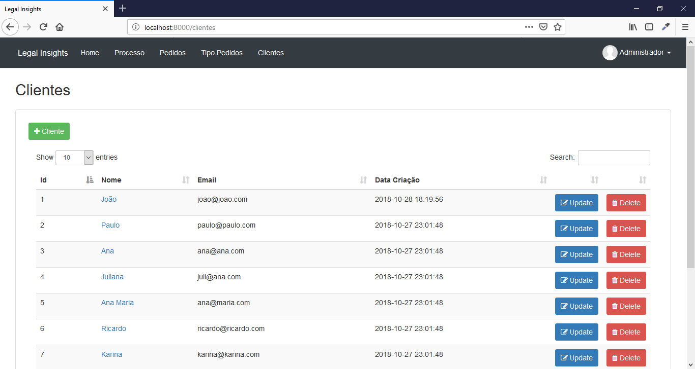
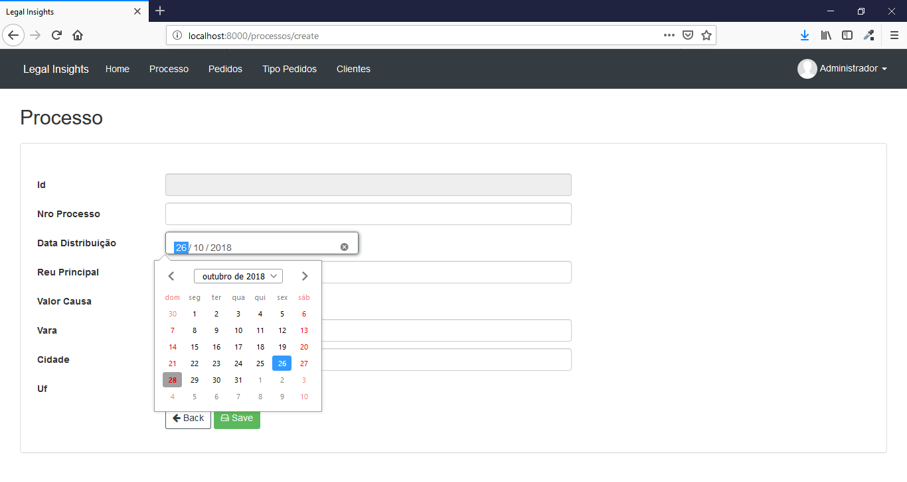
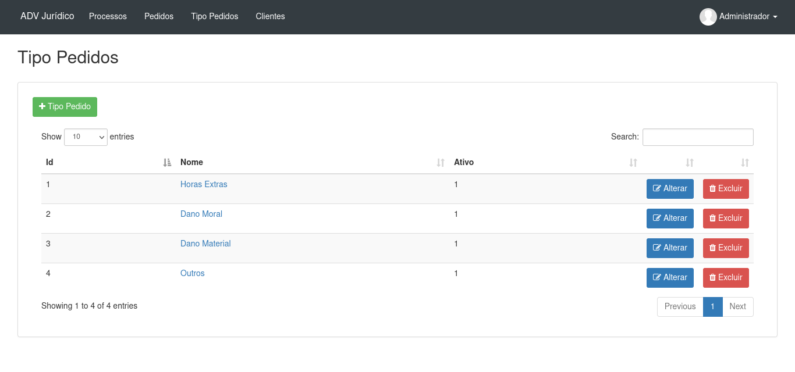
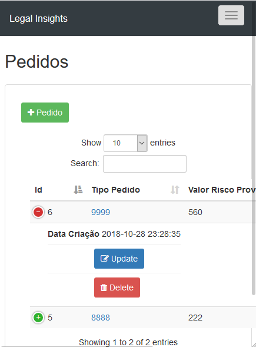
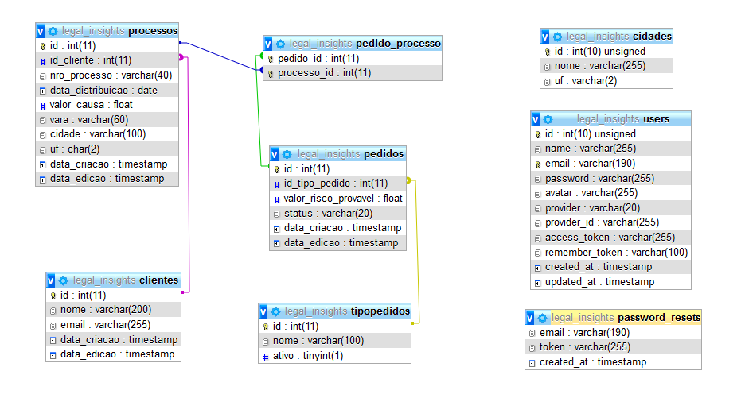

# Legal Insights

Sistema de cadastro de processos jurídicos, desenvolvido em PHP com Laravel.

## Caracteríticas

- OAuth
- Login
- Rotas
- CRUD
- DataTable
- Filtro
- Paginador
- View Blade
- Responsivo

## Requisitos

- PHP >= 5.5.9
- MySql >=5
- Composer

## Tecnologia

- PHP
- JS
- Jquery
- Json
- CSS and SCSS
- Bootstrap
- Composer
- Artisan
- Laravel

## Instalação

```
$ composer install

$ php artisan key:generate

$ php artisan migrate

$ php artisan db:seed
```

Crie um banco de dados com o nome "legal_insights" no seu Mysql.
Você encontra o dump na raiz do projeto (legal_insights.sql) e pode efetuar importação da seguinte forma:

```
$ mysql -u <your user> -p <your password>

mysql> create database `legal_insights`;

mysql> use `legal_insights`;

mysql> source legal_insights.sql
```

Volte o terminal, verifique o arquivo .env e efetue a configuração correta para conexão do seu banco de dados.<br>

Depois de realizado isso, rode o projeto:

```
$ php artisan serve
```

## Acesso ao Sistema

Para acessar o sistema utilize o seguinte endereço:<br>
http://localhost:8000/<br>

- Login:
	- E-mail: admin@admin.com
	- Senha: admin123

## Criação de Novos Módulos

Crie a nova tabela no banco de dados.<br>
Após, use o nome dessa tabela como entrada e execute o seguinte comando:

```
php artisan make:crud TABLE_NAME --master-layout=layouts.app
```

## Licença

Projeto licenciado sob <a href="LICENSE">The MIT License (MIT)</a>.

## Screenshots

 <br><br>
 <br><br>
 <br><br>
 <br><br>
 <br><br>
 <br><br>
 <br><br>
 <br><br>

## Modelo ER

 <br><br>


Desenvolvido por<br>
Danilo Meneghel<br>
danilo.meneghel@gmail.com<br>
http://danilomeneghel.github.io/<br>
