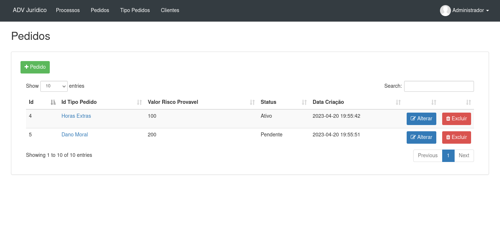

# ADV - Gestão de Processo Jurídico

Sistema de cadastro de processos jurídicos desenvolvido em PHP com Laravel.

## Módulos

- Login
- Processos
- Pedidos
- Tipo de Pedidos
- Clientes

## Requisitos

- PHP >= 7.4.33
- MySql >= 5
- Composer

## Tecnologia

- PHP
- JS
- Jquery
- Json
- CSS and SCSS
- Bootstrap
- Composer
- Artisan
- Laravel

## Instalação

Crie um banco de dados com o nome "adv" no seu Mysql.
Verifique o arquivo .env e efetue a configuração correta para conexão do seu banco de dados.<br>

```
$ mysql -u <your user> -p

mysql> create database `adv`;
```

Após criado o banco de dados, abra o terminal e execute o seguinte comando:

```
$ ./install.sh
```

Caso de algum erro e não consiga instalar, execute os seguintes comandos separadamente:

```
$ composer install

$ php artisan key:generate

$ php artisan migrate

$ php artisan db:seed
```

Depois de realizado isso, rode o projeto:

```
$ php artisan serve
```

## Acesso ao Sistema

Para acessar o sistema utilize o seguinte endereço:<br>
http://localhost:8000/<br>

- Login:
	- E-mail: admin@admin.com
	- Senha: admin

## Criação de Novos Módulos

Crie a nova tabela no banco de dados.<br>
Após, use o nome dessa tabela como entrada e execute o seguinte comando:

```
php artisan make:crud TABLE_NAME --master-layout=layouts.app
```

## Licença

Projeto licenciado sob <a href="LICENSE">The MIT License (MIT)</a>.

## Screenshots

 <br><br>
 <br><br>
 <br><br>
 <br><br>
 <br><br>
 <br><br>
 <br><br>
 <br><br>
 <br><br>

## Modelo ER

 <br><br>


Desenvolvido por<br>
Danilo Meneghel<br>
danilo.meneghel@gmail.com<br>
http://danilomeneghel.github.io/<br>
