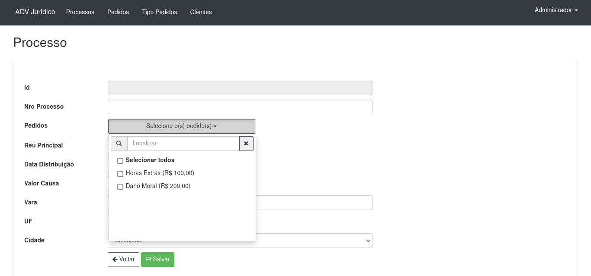
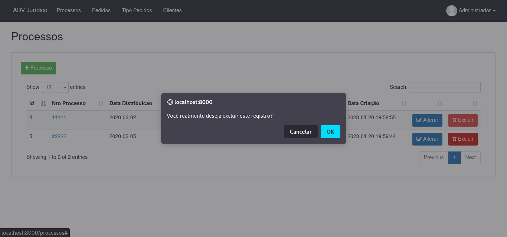

# Legal Insights

Projeto realizado para empresa Legal Insights, desenvolvido em PHP com Laravel.

## Caracteríticas

- OAuth
- Login
- Rotas
- CRUD
- DataTable
- Filtro
- Paginador
- View Blade
- Responsivo

## Requisitos

- PHP >= 5.5.9
- MySql >=5
- Composer

## Tecnologia

- PHP
- JS
- Jquery
- Json
- CSS and SCSS
- Bootstrap
- Composer
- Artisan

## Instalação

```
$ git clone https://github.com/danilomeneghel/legal_insights.git

$ cd legal_insights

$ composer install
```

Then create a database with name legal_insights in your mysql.
Then run the following commands:

```
$ mysql -u <your user> -p <your password>

mysql> create database `legal_insights`;
```

Back to terminal, check if the .env file has the correct data to connect to the database and run Artisan:

```
$ php artisan key:generate

$ php artisan migrate

$ php artisan db:seed
```

After everything is done, run the project:

```
$ php artisan serve
```

Finally open http://localhost:8000/ in your browser.

## Login

	- E-mail: admin@admin.com
	- Senha: admin123
	
```

## Criação de Novos Módulos

Crie a nova tabela no banco de dados.<br>
Após, use o nome dessa tabela como entrada e execute o seguinte comando:

```
php artisan make:crud TABLE_NAME --master-layout=layouts.app
```

## Licença

Projeto licenciado sob <a href="license.md">The MIT License (MIT)</a>.

## Screenshots

<br><br>
<br><br>
<br><br>
<br><br>
<br><br>
<br><br>
<br><br>
<br><br>
<br><br>


Developed by<br>
Danilo Meneghel<br>
danilo.meneghel@gmail.com<br>
http://danilomeneghel.github.io/<br>
